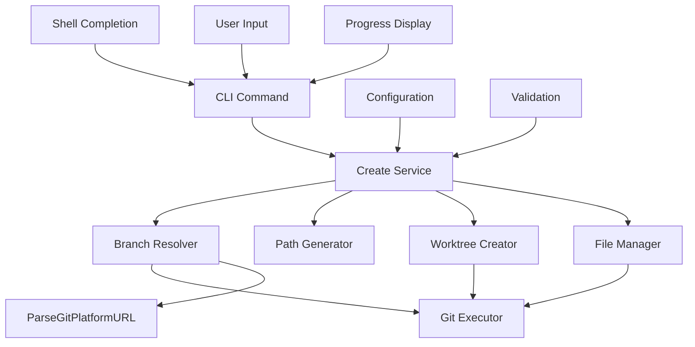

# Design Document

## Overview

The `grove create` command enables users to create new Git worktrees from existing or new branches with intelligent automation and intuitive defaults. This feature builds upon Grove's existing worktree infrastructure to provide a seamless experience for multi-branch development workflows.

## Steering Document Alignment

### Technical Standards (tech.md)

- **Go Standards**: Follow Go best practices with comprehensive error handling and 90%+ test coverage
- **CLI Framework**: Use Cobra for command structure with Viper for configuration
- **Performance**: Ensure snappy operations (< 5s for local, < 15s for remote) with progress indicators
- **Testing**: Use testify framework with standardized mock patterns from `/internal/testutils/`
- **Dependencies**: Leverage existing Charm Bracelet Lipgloss for consistent terminal styling

### Project Structure (structure.md)

- **Command Location**: Implementation in `/internal/commands/create.go`
- **Test Organization**: Unit tests in `create_test.go`, integration tests in `create_integration_test.go`
- **Error Handling**: Use centralized error patterns from `/internal/errors/`
- **Configuration**: Follow hierarchy of CLI flags → env vars → config files → defaults

## Code Reuse Analysis

**Existing Components to Leverage:**

- **Worktree Creation**: `CreateWorktreeWithSafeNaming()` and `CreateWorktreeFromExistingBranch()` (internal/git/worktree.go:90, 136)
- **Path Generation**: `BranchToDirectoryName()` and `NormalizeBranchName()` (internal/git/naming.go)
- **Git Operations**: `GitExecutor` interface and retry mechanisms (internal/git/operations.go:18-22)
- **URL Parsing**: `ParseGitPlatformURL()` for comprehensive Git platform URL support (internal/utils/git.go:185)
- **Command Patterns**: Cobra command structure from `init.go` (internal/commands/init.go:17-40)
- **Branch Completion**: `BranchCompletion()` for shell autocompletion (internal/completion/branch.go:11)
- **Configuration**: Default configuration patterns (internal/config/defaults.go)
- **Error Handling**: Standardized error wrapping utilities (internal/errors/wrap.go)

**Integration Points:**

- Main command registration in `cmd/grove/main.go`
- Configuration system integration for path preferences and naming conventions
- Completion system for branch name suggestions and path completion
- Existing Git operation patterns with timeout and retry mechanisms

## Architecture

The create command follows Grove's established patterns with a service-oriented architecture that separates concerns between command handling, business logic, and Git operations.



## Components and Interfaces

### CreateCommand

- **Purpose**: CLI command interface and argument parsing
- **Interfaces**: Cobra command with flags and completion
- **Dependencies**: CreateService, configuration, completion system
- **Reuses**: Command patterns from `init.go`, completion from `branch.go`

### CreateService

- **Purpose**: Business logic for worktree creation workflow
- **Interfaces**: `Create(options CreateOptions) (*CreateResult, error)`
- **Dependencies**: BranchResolver, PathGenerator, WorktreeCreator
- **Reuses**: Configuration patterns, error handling utilities

### BranchResolver

- **Purpose**: Determine if branch exists, handle creation logic, and resolve URLs/remote branches
- **Interfaces**:
    - `ResolveBranch(name, base string, createIfMissing bool) (*BranchInfo, error)`
    - `ResolveURL(url string) (*URLBranchInfo, error)`
    - `ResolveRemoteBranch(remoteBranch string) (*BranchInfo, error)`
- **Dependencies**: GitExecutor, ParseGitPlatformURL
- **Reuses**: Existing Git operation patterns, retry mechanisms, and URL parsing utilities

### PathGenerator

- **Purpose**: Generate filesystem-safe paths for worktrees
- **Interfaces**: `GeneratePath(branchName, basePath string) (string, error)`
- **Dependencies**: Configuration for path preferences
- **Reuses**: `BranchToDirectoryName()` and existing naming utilities

### WorktreeCreator

- **Purpose**: Execute worktree creation operations
- **Interfaces**: `CreateWorktree(branchName, path string, options WorktreeOptions) error`
- **Dependencies**: GitExecutor
- **Reuses**: `CreateWorktreeWithSafeNaming()` and `CreateWorktreeFromExistingBranch()`

### FileManager

- **Purpose**: Handle copying of untracked files from source worktree to new worktree
- **Interfaces**:
    - `CopyFiles(sourceWorktree, targetWorktree string, patterns []string, options CopyOptions) error`
    - `DiscoverSourceWorktree() (string, error)`
    - `ResolveConflicts(conflicts []FileConflict, strategy ConflictStrategy) error`
- **Dependencies**: Configuration, filesystem operations
- **Reuses**: Configuration patterns and error handling utilities

## Data Models

```go
// CreateOptions encapsulates all options for worktree creation
type CreateOptions struct {
    BranchName      string // Target branch name or URL
    WorktreePath    string // Optional specific path
    BaseBranch      string // Base branch for new branch creation
    CreateBranch    bool   // Force create branch without prompting
    Force           bool   // Force creation even if path exists
    CopyFiles       bool   // Whether to copy files from source worktree
    CopyPatterns    []string // Specific patterns to copy (overrides config)
    CopyEnv         bool   // Quick flag to copy environment files
    SourceWorktree  string // Specific source worktree for file copying
}

// CreateResult contains information about the created worktree
type CreateResult struct {
    WorktreePath    string // Actual path of created worktree
    BranchName      string // Actual branch name used
    WasCreated      bool   // Whether branch was newly created
    BaseBranch      string // Base branch used (if applicable)
}

// BranchInfo contains resolved branch information
type BranchInfo struct {
    Name            string // Normalized branch name
    Exists          bool   // Whether branch exists
    IsRemote        bool   // Whether branch exists only remotely
    TrackingBranch  string // Remote tracking branch (if applicable)
    RemoteName      string // Name of remote (if from remote branch)
}

// URLBranchInfo contains information extracted from platform URLs
type URLBranchInfo struct {
    RepoURL         string // Repository URL for cloning
    BranchName      string // Target branch name
    PRNumber        string // Pull request number (if applicable)
    Platform        string // Platform name (github, gitlab, etc.)
    RequiresRemote  bool   // Whether remote needs to be added
}

// WorktreeOptions contains options for worktree creation
type WorktreeOptions struct {
    TrackRemote     bool   // Whether to track remote branch
    Force           bool   // Force creation overwriting existing
}

// CopyOptions contains options for file copying
type CopyOptions struct {
    ConflictStrategy ConflictStrategy // How to handle file conflicts
    DryRun          bool             // Whether to simulate copying
}

// ConflictStrategy defines how to handle file conflicts
type ConflictStrategy string

const (
    ConflictPrompt    ConflictStrategy = "prompt"
    ConflictSkip      ConflictStrategy = "skip"
    ConflictOverwrite ConflictStrategy = "overwrite"
    ConflictBackup    ConflictStrategy = "backup"
)

// FileConflict represents a file that exists in both source and target
type FileConflict struct {
    Path            string // Relative path of conflicting file
    SourcePath      string // Full path in source worktree
    TargetPath      string // Full path in target worktree
}
```

## Error Handling

Following Grove's standardized error handling patterns:

```go
// Standardized error types for create command
var (
    ErrNotGroveRepository = errors.New("not in a Grove repository")
    ErrBranchNotFound     = errors.New("branch not found")
    ErrPathExists         = errors.New("path already exists")
    ErrInvalidBranchName  = errors.New("invalid branch name")
    ErrWorktreeCreation   = errors.New("worktree creation failed")
    ErrUnsupportedURL     = errors.New("unsupported URL format")
    ErrRemoteNotFound     = errors.New("remote not found")
    ErrFileCopyFailed     = errors.New("file copying failed")
    ErrSourceWorktreeNotFound = errors.New("source worktree not found")
)

// Error wrapping with context
func (s *CreateService) Create(options CreateOptions) (*CreateResult, error) {
    if err := s.validateOptions(options); err != nil {
        return nil, errors.Wrap(err, "invalid create options")
    }

    branchInfo, err := s.branchResolver.ResolveBranch(options.BranchName, options.BaseBranch, options.CreateBranch)
    if err != nil {
        return nil, errors.Wrap(err, "failed to resolve branch")
    }

    // Continue with proper error context...
}
```

## Testing Strategy

### Unit Tests

- **CreateService**: Mock all dependencies, test business logic flows
- **BranchResolver**: Mock GitExecutor, test branch resolution logic
- **PathGenerator**: Test path generation and collision handling
- **CLI Command**: Test argument parsing and flag handling

**Leverages**: Existing mock patterns from `/internal/testutils/mocks.go`

### Integration Tests

- **End-to-End**: Test complete create workflow in temporary repositories
- **Git Operations**: Test actual Git worktree creation and branch handling
- **Configuration**: Test integration with Grove configuration system

**Leverages**: Test utilities from `/internal/testutils/fixtures.go`

### Test Coverage

- Target 90%+ coverage following Grove standards
- Focus on error paths and edge cases
- Include performance tests for large repository scenarios

## Command Line Interface

```bash
# Basic usage
grove create feature-branch              # Create worktree for existing branch
grove create feature-branch ./custom     # Create at specific path

# New branch creation
grove create new-feature --create         # Create new branch without prompting
grove create new-feature -c               # Short flag version
grove create new-feature --base main      # Create from specific base branch

# URL and remote branch support
grove create https://github.com/owner/repo/pull/123    # Create from GitHub PR
grove create https://gitlab.com/owner/repo/-/merge_requests/456  # GitLab MR
grove create origin/feature-branch        # Create from remote branch
grove create upstream/hotfix-123          # Create from upstream remote

# File copying options
grove create feature-branch --copy-env    # Copy environment files
grove create feature-branch --copy ".env,.vscode/"  # Copy specific patterns
grove create feature-branch --no-copy     # Skip file copying

# Path handling
grove create feature --force              # Force creation if path exists

# Examples with completion
grove create <TAB>                        # Shows available branches
grove create --base <TAB>                 # Shows base branch options
grove create branch-name <TAB>            # Shows path completion
```

## Configuration Integration

```toml
[worktree]
  base_path = "~/code/worktrees"           # Default base path for worktrees
  naming_style = "branch"                  # "branch" or "custom"
  auto_track_remote = true                 # Automatically track remote branches

[worktree.copy_files]
  patterns = [".env*", ".vscode/", "*.local.json"]  # Files to copy automatically
  source_worktree = "main"                 # Source worktree for file copying
  on_conflict = "prompt"                   # "prompt", "skip", "overwrite", "backup"

[create]
  default_base_branch = "main"             # Default base for new branches
  prompt_for_new_branch = true             # Prompt before creating new branches
  auto_create_parents = true               # Create parent directories
```

## Shell Completion

```go
// Branch name completion
func createCompletionBranch(cmd *cobra.Command, args []string, toComplete string) ([]string, cobra.ShellCompDirective) {
    return completion.BranchCompletion(completion.NewContext(), cmd, args, toComplete)
}

// Base branch completion
func createCompletionBaseBranch(cmd *cobra.Command, args []string, toComplete string) ([]string, cobra.ShellCompDirective) {
    return completion.BranchCompletion(completion.NewContext(), cmd, args, toComplete)
}

// Path completion
func createCompletionPath(cmd *cobra.Command, args []string, toComplete string) ([]string, cobra.ShellCompDirective) {
    return nil, cobra.ShellCompDirectiveFilterDirs
}
```

## Implementation Flow

1. **Command Parsing**: Parse CLI arguments and flags using Cobra patterns
2. **Input Classification**: Determine if input is branch name, URL, or remote branch reference
3. **URL/Remote Resolution**: If URL or remote branch, resolve using ParseGitPlatformURL or remote branch logic
4. **Validation**: Validate Grove repository, branch names, and paths
5. **Branch Resolution**: Determine if branch exists, prompt for creation if needed, handle remote fetching
6. **Path Generation**: Generate safe worktree path using existing naming utilities
7. **Source Worktree Discovery**: Identify source worktree for file copying (if enabled)
8. **Worktree Creation**: Execute Git worktree creation using existing functions
9. **File Copying**: Copy configured files from source worktree with conflict resolution
10. **Result Display**: Show success message with next steps using Lipgloss styling
11. **Error Handling**: Provide actionable error messages with troubleshooting context

## Success Metrics

- **Performance**: Local branch worktrees created in < 5 seconds
- **Reliability**: 100% cleanup on failure, atomic operations where possible
- **Usability**: Clear error messages with actionable next steps
- **Integration**: Seamless shell completion and configuration integration
