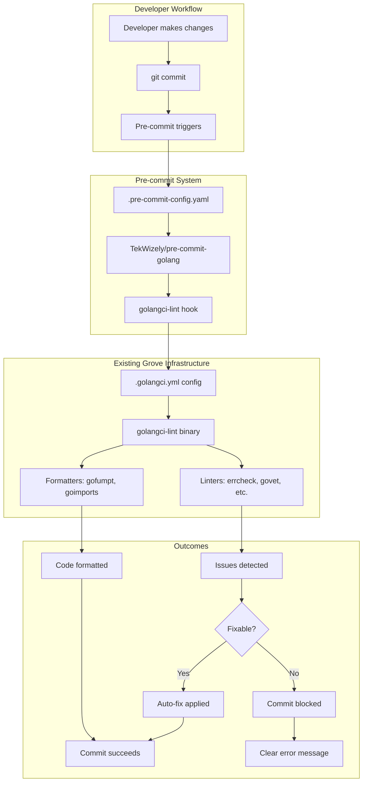

# Design: Ensure Code Quality via Pre-commit Hook

## Overview

This design implements fast, lightweight pre-commit hooks for Grove that enforce code quality through golangci-lint integration. The solution leverages TekWizely/pre-commit-golang hooks to seamlessly integrate with Grove's existing `.golangci.yml` configuration, ensuring consistent code quality without disrupting developer workflow.

## Code Reuse Analysis

**Existing Infrastructure Leveraged:**

- **`.golangci.yml`**: Complete linting configuration with formatters (gofumpt, goimports) and enabled linters
- **`mage lint`**: Current linting workflow that developers are familiar with
- **`docs/CONTRIBUTING.md`**: Existing contributor documentation structure
- **`internal/testutils/`**: Testing utilities for hook validation tests

**External Dependency:**

- **TekWizely/pre-commit-golang**: Mature, well-maintained pre-commit hooks specifically designed for Go projects with golangci-lint integration

## Architecture

### System Components



### Integration Flow

1. **Developer commits code** → Triggers pre-commit hooks
2. **Pre-commit framework** → Reads `.pre-commit-config.yaml`
3. **TekWizely hook** → Executes golangci-lint with Grove's configuration
4. **golangci-lint** → Uses existing `.golangci.yml` settings
5. **Formatters run** → gofumpt, goimports applied automatically
6. **Linters execute** → errcheck, govet, staticcheck, etc.
7. **Results processed** → Auto-fix or block commit with clear feedback

## Component Design

### 1. Pre-commit Configuration (`.pre-commit-config.yaml`)

**Purpose**: Define which hooks run and their configuration
**Location**: Project root
**Integration**: Uses TekWizely/pre-commit-golang repository

```yaml
repos:
    - repo: https://github.com/TekWizely/pre-commit-golang
      rev: v1.0.0-rc.1 # Use latest stable version
      hooks:
          - id: golangci-lint
            name: golangci-lint
            description: Fast Multi-Linter for Go
            args: [--fix] # Enable auto-fixing
            alias: lint
```

**Design Decisions:**

- **Single hook**: Only golangci-lint (includes go fmt, go vet, formatters)
- **Auto-fix enabled**: `--fix` argument for automatic issue resolution
- **Existing config**: Leverages `.golangci.yml` automatically
- **Alias**: Provides `lint` shorthand for developer convenience

### 2. Hook Execution Engine

**Provider**: TekWizely/pre-commit-golang
**Hook Type**: `golangci-lint`
**Execution Context**: Pre-commit stage only

**Features Utilized:**

- **Automatic config detection**: Finds and uses `.golangci.yml`
- **Multi-file processing**: Efficient handling of changed files
- **Error reporting**: Clear, actionable feedback on failures
- **Cross-platform support**: Windows, macOS, Linux compatibility

### 3. Linting Configuration Reuse

**Existing File**: `.golangci.yml`
**Strategy**: Zero modification required
**Integration**: Automatic detection by golangci-lint hook

**Current Configuration Highlights:**

```yaml
formatters:
    enable:
        - gofumpt # Strict formatting
        - goimports # Import organization

linters:
    enable:
        - errcheck # Unchecked errors
        - govet # Go vet analysis
        - staticcheck # Static analysis
        - gocritic # Comprehensive diagnostics
        # ... and more
```

### 4. Developer Experience Integration

**Command Compatibility:**

- `mage lint` → Still works independently
- `pre-commit run --all-files` → Manual hook execution
- `git commit --no-verify` → Emergency bypass option

**Feedback Mechanism:**

- **Success**: Clear summary of checks passed
- **Failure**: Specific file/line error details
- **Auto-fix**: Report of automatic corrections applied

## Data Flow

### Successful Commit Flow

```
Developer Code Changes
        ↓
   git commit command
        ↓
Pre-commit hook triggers
        ↓
TekWizely golangci-lint hook
        ↓
Reads .golangci.yml config
        ↓
Runs formatters (gofumpt, goimports)
        ↓
Runs linters (errcheck, govet, etc.)
        ↓
All checks pass
        ↓
Commit proceeds successfully
```

### Failed Commit Flow (Auto-fixable)

```
Developer Code Changes
        ↓
   git commit command
        ↓
Pre-commit hook triggers
        ↓
Issues detected (formatting, imports)
        ↓
Auto-fix applied (--fix flag)
        ↓
Files modified in working directory
        ↓
Developer reviews changes
        ↓
Re-run commit (hooks pass)
```

### Failed Commit Flow (Non-fixable)

```
Developer Code Changes
        ↓
   git commit command
        ↓
Pre-commit hook triggers
        ↓
Linting errors detected
        ↓
Clear error messages displayed
        ↓
Commit blocked
        ↓
Developer fixes issues manually
        ↓
Re-run commit
```

## Error Handling Strategy

### 1. Missing Dependencies

**Scenario**: pre-commit or golangci-lint not installed
**Response**: Clear installation instructions in error message
**Documentation**: Update CONTRIBUTING.md with setup steps

### 2. Configuration Issues

**Scenario**: .golangci.yml syntax errors
**Response**: Leverage existing golangci-lint error reporting
**Fallback**: Use default golangci-lint configuration

### 3. Performance Issues

**Scenario**: Hook execution exceeds 5-second target
**Response**: Profile and optimize hook configuration
**Mitigation**: Document skip options for urgent commits

### 4. Platform-specific Problems

**Scenario**: Windows path or permission issues
**Response**: Leverage TekWizely's cross-platform testing
**Escalation**: Clear error messages with platform-specific guidance

## Testing Strategy

### Hook Validation Tests

**Location**: `internal/testutils/` (extending existing patterns)
**Framework**: Go testing with existing test utilities

**Test Categories:**

1. **Configuration Tests**: Validate .pre-commit-config.yaml syntax
2. **Integration Tests**: Verify hook execution with sample violations
3. **Performance Tests**: Ensure execution time under 5 seconds
4. **Cross-platform Tests**: Windows, macOS, Linux compatibility

**Test Implementation Example:**

```go
func TestPreCommitHookExecution(t *testing.T) {
    testDir := testutils.NewTestDirectory(t, "precommit-test-*")
    defer testDir.Cleanup()

    // Create sample Go file with linting violations
    // Run pre-commit hook
    // Assert violations detected and/or fixed
    // Verify performance requirements met
}
```

### Manual Testing Scenarios

1. **Fresh clone**: Verify setup instructions work
2. **Various violations**: Test different linting rule violations
3. **Large changesets**: Performance with many modified files
4. **Emergency bypass**: Confirm `--no-verify` works as expected

## Performance Considerations

### Target Metrics

- **Total execution time**: Under 5 seconds
- **golangci-lint execution**: Under 3 seconds
- **Hook overhead**: Under 1 second

### Optimization Strategies

1. **Incremental linting**: Only check modified files
2. **Configuration caching**: Leverage golangci-lint's built-in caching
3. **Parallel execution**: TekWizely hooks support concurrent processing
4. **Selective enablement**: Only essential linters (already configured)

## Security Considerations

### Hook Repository Trust

- **Source**: TekWizely/pre-commit-golang (established, well-maintained)
- **Versioning**: Pin to specific release tags, not floating references
- **Review**: Regular updates with security patch awareness

### Execution Context

- **Permissions**: Hooks run with developer's local permissions
- **Network access**: Minimal (only for initial hook installation)
- **File access**: Limited to git repository contents

## Deployment Strategy

### Phase 1: Configuration Files

1. Create `.pre-commit-config.yaml` with golangci-lint hook
2. No changes to existing `.golangci.yml` required
3. Test configuration in development environment

### Phase 2: Documentation Updates

1. Update `docs/CONTRIBUTING.md` with pre-commit setup instructions
2. Add troubleshooting section for common issues
3. Document integration with existing Mage workflow

### Phase 3: Validation and Testing

1. Implement hook validation tests in `internal/testutils/`
2. Cross-platform testing on Windows, macOS, Linux
3. Performance validation against 5-second target

### Phase 4: Developer Communication

1. Clear migration path from current workflow
2. Benefits communication (faster feedback, consistent quality)
3. Support for setup questions and issues

## Backwards Compatibility

**Existing Workflow Preservation:**

- `mage lint` continues to work unchanged
- `mage ci` pipeline remains functional
- `.golangci.yml` configuration unchanged
- All existing Make targets unaffected

**Incremental Adoption:**

- Pre-commit hooks are opt-in via installation
- Developers can choose when to enable
- Emergency bypass always available (`--no-verify`)

## Success Metrics

### Technical Metrics

- Hook execution time consistently under 5 seconds
- Zero disruption to existing `mage` workflow
- Cross-platform compatibility verified
- 100% reuse of existing `.golangci.yml` configuration

### Developer Experience Metrics

- Reduced manual linting steps
- Faster feedback on code quality issues
- Consistent code formatting across all commits
- Clear, actionable error messages when issues occur

### Quality Metrics

- Maintained or improved code quality consistency
- Reduced linting failures in CI pipeline
- Increased developer confidence in code submissions

## Future Enhancements

### Potential Additions (Post-Implementation)

1. **Custom Grove-specific hooks**: Repository-specific validations
2. **Performance optimization**: Fine-tuning based on usage patterns
3. **IDE integration**: Extensions for popular Go IDEs
4. **Metrics collection**: Optional anonymous usage statistics

### Integration Opportunities

1. **GitHub Actions**: Ensure pre-commit config aligns with CI
2. **Development containers**: Include pre-commit in devcontainer setup
3. **Documentation generation**: Automated updates to hook documentation
