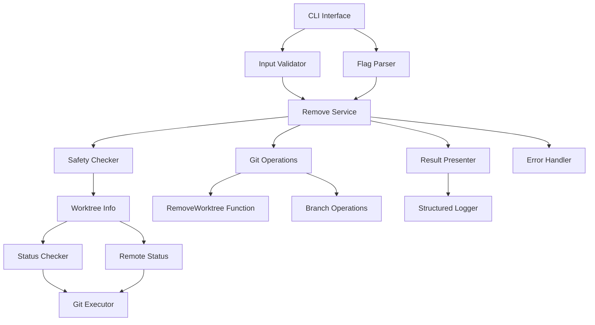

# Design Document

## Overview

The remove command provides safe, intelligent worktree cleanup capabilities that integrate seamlessly with Grove's existing infrastructure. The design leverages the established `RemoveWorktree()` function and `WorktreeInfo` system to provide comprehensive removal operations with safety checks, validation, and optional branch cleanup. The command follows Grove's established patterns for CLI structure, error handling, and user feedback while implementing intelligent automation that prevents data loss.

## Steering Document Alignment

### Technical Standards (tech.md)

The design adheres to established technical standards:

- **Go Standards**: Follows Go best practices with comprehensive error handling and standardized error codes
- **CLI Framework**: Uses Cobra for command structure consistent with existing commands (init, create, list, config)
- **Performance**: Implements parallel safety checks where possible while maintaining <2s response times
- **Architecture**: Follows standard Go project layout with commands in `/internal/commands/remove/`
- **Testing**: Maintains 90%+ test coverage with unit, integration, and mock tests using testify framework
- **Logging**: Uses structured logging with configurable levels for debugging and user feedback

### Project Structure (structure.md)

Implementation follows established project organization:

- **Command Location**: `/internal/commands/remove/` following existing pattern
- **File Organization**: Main command file `remove.go`, service logic `remove_service.go`, tests `*_test.go`
- **Integration Tests**: `remove_integration_test.go` for cross-component testing
- **Error Handling**: Leverages centralized error definitions in `/internal/errors/`
- **Git Operations**: Extends existing `/internal/git/worktree.go` functionality
- **Testing Utilities**: Uses centralized mocks from `/internal/testutils/mocks.go`

## Code Reuse Analysis

### Existing Components to Leverage

- **RemoveWorktree() function**: Core removal functionality already exists at `internal/git/worktree.go:129`
- **WorktreeInfo struct**: Rich metadata including status, remote tracking, activity timestamps
- **ListWorktrees() function**: For identifying worktrees in bulk operations
- **GitExecutor interface**: Established pattern for Git operations with comprehensive error handling
- **Logger infrastructure**: Structured logging with component-specific contexts
- **Error handling utilities**: Standardized error codes and user-friendly messaging from `/internal/errors/`
- **Command validation patterns**: Input validation and safety checks from existing commands
- **Shell completion system**: Auto-completion for worktree paths using existing `/internal/completion/` infrastructure

### Integration Points

- **CLI Registration**: Extends `cmd/grove/main.go` with `commands.NewRemoveCmd()`
- **Git Operations**: Builds on existing `GitExecutor` interface and `worktree.go` functions
- **Configuration System**: Leverages existing config for default behaviors and user preferences
- **Error Reporting**: Integrates with existing error handling and user feedback patterns
- **Testing Infrastructure**: Uses established test patterns, fixtures, and mocks

## Architecture

The remove command follows Grove's established layered architecture with clear separation of concerns:



## Components and Interfaces

### CLI Command Component

- **Purpose:** Provides user interface for remove operations with comprehensive flag support
- **Interfaces:**
    - `NewRemoveCmd() *cobra.Command` - Creates the remove command
    - Flags: `--force`, `--dry-run`, `--delete-branch`, `--merged`, `--stale`, `--all`
- **Dependencies:** Cobra CLI framework, flag validation, completion system
- **Reuses:** Existing command patterns from create/list commands, completion infrastructure

### Remove Service

- **Purpose:** Core business logic for worktree removal with safety validation
- **Interfaces:**
    - `RemoveWorktree(path string, options RemoveOptions) error`
    - `RemoveBulk(criteria BulkCriteria, options RemoveOptions) (RemoveResults, error)`
    - `ValidateRemoval(path string) (SafetyReport, error)`
- **Dependencies:** GitExecutor, WorktreeInfo, safety validation
- **Reuses:** Existing `RemoveWorktree()` function, `ListWorktrees()`, `WorktreeInfo` structure

### Safety Checker

- **Purpose:** Validates safety conditions before removal operations
- **Interfaces:**
    - `CheckUncommittedChanges(path string) (bool, error)`
    - `CheckBranchSafety(branch string) (BranchSafetyStatus, error)`
    - `CheckCurrentWorktree(path string) (bool, error)`
- **Dependencies:** GitExecutor, WorktreeInfo.Status, RemoteStatus
- **Reuses:** Existing status checking from `getWorktreeStatus()`, `getRemoteStatus()`

### Branch Manager

- **Purpose:** Handles optional branch cleanup with intelligent safety logic
- **Interfaces:**
    - `DeleteBranchSafely(branchName string) error`
    - `CanDeleteBranchAutomatically(branchName string) (bool, string)`
    - `DeleteRemoteBranch(branchName string) error`
- **Dependencies:** GitExecutor, RemoteStatus information
- **Reuses:** Existing remote status tracking, Git operation patterns

## Data Models

### RemoveOptions

```go
type RemoveOptions struct {
    Force        bool   // Skip safety checks
    DryRun       bool   // Show what would be removed
    DeleteBranch bool   // Remove associated branch
    Days         int    // For --stale operations
}
```

### BulkCriteria

```go
type BulkCriteria struct {
    Merged    bool   // Remove merged worktrees
    Stale     bool   // Remove stale worktrees
    All       bool   // Remove all non-current worktrees
    DaysOld   int    // Minimum age for stale
}
```

### SafetyReport

```go
type SafetyReport struct {
    Path              string
    HasUncommitted    bool
    IsCurrent         bool
    BranchStatus      BranchSafetyStatus
    Warnings          []string
    CanRemoveSafely   bool
}
```

### BranchSafetyStatus

```go
type BranchSafetyStatus struct {
    BranchName        string
    IsMerged          bool
    IsPushedToRemote  bool
    CanDeleteAuto     bool
    RequiresConfirm   bool
    Reason            string
}
```

### RemoveResults

```go
type RemoveResults struct {
    Removed       []string
    Skipped       []RemoveSkip
    Failed        []RemoveFailure
    Summary       RemoveSummary
}
```

## Error Handling

### Error Scenarios

1. **Worktree Not Found**
    - **Handling:** Check path existence, provide clear "not found" message
    - **User Impact:** Clear error with suggested `grove list` command

2. **Uncommitted Changes**
    - **Handling:** Block removal, display file list, suggest `--force` or commit
    - **User Impact:** Detailed warning with actionable next steps

3. **Current Worktree Removal**
    - **Handling:** Block removal, suggest switching to different worktree first
    - **User Impact:** Clear error with suggested `grove list` and switch commands

4. **Permission Denied**
    - **Handling:** Attempt cleanup, report partial success/failure status
    - **User Impact:** Actionable error message with suggested permission fixes

5. **Git Operation Failures**
    - **Handling:** Graceful degradation, attempt cleanup, detailed error reporting
    - **User Impact:** Technical details with user-friendly explanation

6. **Branch Deletion Failures**
    - **Handling:** Complete worktree removal, report branch deletion failure separately
    - **User Impact:** Success message for worktree with branch deletion warning

## Testing Strategy

### Unit Testing

- **Safety validation logic**: Test all safety check scenarios with various worktree states
- **Branch safety determination**: Test automatic vs. confirmation logic for different branch states
- **Flag parsing and validation**: Comprehensive input validation testing
- **Error handling paths**: Test all error scenarios with appropriate mocks
- **Reuse existing test patterns**: Leverage established test utilities and fixtures

### Integration Testing

- **End-to-end removal flows**: Test complete removal processes with real Git repositories
- **Bulk operations**: Test merged/stale/all removal operations with multiple worktrees
- **Branch cleanup integration**: Test worktree + branch removal combinations
- **Error recovery**: Test interrupted operations and cleanup behavior
- **Use existing integration test patterns**: Follow established `*_integration_test.go` conventions

### End-to-End Testing

- **User workflow scenarios**: Test typical developer cleanup workflows
- **Safety edge cases**: Test boundary conditions and safety validations
- **Cross-platform behavior**: Ensure consistent behavior across Windows/macOS/Linux
- **Performance validation**: Verify operations complete within performance requirements
- **Leverage existing infrastructure**: Use established test fixtures and repository setups
