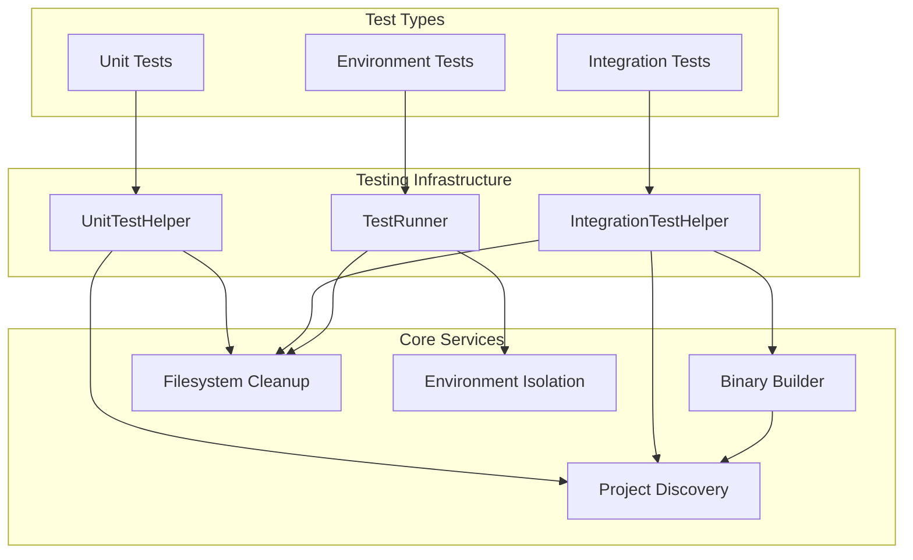
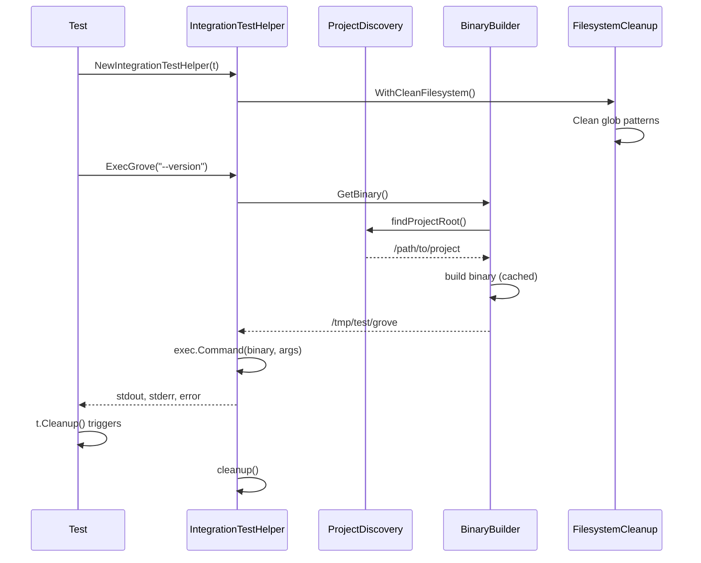
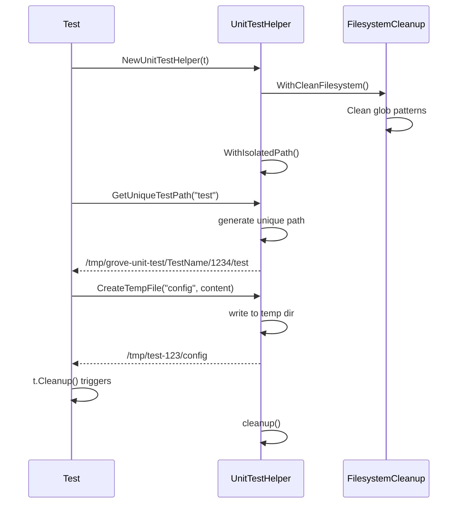

# Robust Testing Infrastructure Design

## Overview

This document describes the technical design for a comprehensive testing infrastructure that eliminates test brittleness through isolation, automatic cleanup, and robust build processes.

## Architecture

### System Overview



### Component Design

#### 1. IntegrationTestHelper

**Purpose**: Provides robust integration test execution with automatic binary building and isolation.

**Key Features**:

- Project root auto-discovery
- Binary build caching
- Execution environment isolation
- Cleanup automation

```go
type IntegrationTestHelper struct {
    binaryPath     string
    buildOnce      sync.Once
    buildErr       error
    originalDir    string
    tempDir        string
    t              *testing.T
}
```

**API Design**:

```go
// Fluent interface for configuration
helper := testutils.NewIntegrationTestHelper(t).
    WithCleanFilesystem("/tmp/grove-*", "/tmp/test-*")

// Simple execution
stdout, stderr, err := helper.ExecGrove("--version")
stdout, stderr, err := helper.ExecGroveInDir("/tmp", "--help")
```

#### 2. UnitTestHelper

**Purpose**: Provides isolated unit test execution with unique paths and automatic cleanup.

**Key Features**:

- Unique path generation per test
- Temporary file/directory utilities
- Automatic cleanup registration
- File existence assertions

```go
type UnitTestHelper struct {
    t           *testing.T
    tempDir     string
    originalDir string
    cleanupFns  []func()
}
```

**API Design**:

```go
// Fluent interface for configuration
helper := testutils.NewUnitTestHelper(t).
    WithCleanFilesystem().
    WithIsolatedPath()

// Path utilities
testPath := helper.GetUniqueTestPath("validation-test")
tempFile := helper.CreateTempFile("config.toml", content)
tempDir := helper.CreateTempDir("test-workspace")

// Assertions
helper.AssertFileExists("/tmp/expected-file")
helper.AssertNoFileExists("/tmp/should-not-exist")
```

#### 3. TestRunner

**Purpose**: Provides complete environment isolation for tests that need clean state.

**Key Features**:

- Environment variable isolation
- Working directory isolation
- Combined isolation strategies
- Automatic restoration

```go
type TestRunner struct {
    t           *testing.T
    originalDir string
    cleanupFns  []func()
}
```

**API Design**:

```go
// Fluent interface for isolation
runner := testutils.NewTestRunner(t).
    WithCleanEnvironment().
    WithIsolatedWorkingDir().
    WithCleanFilesystem()

// Execute with isolation
runner.Run(func() {
    // Test logic runs in isolated environment
})
```

### Core Services

#### 1. Project Discovery Service

**Purpose**: Reliably locate project root regardless of test execution directory.

**Algorithm**:

1. Use `runtime.Caller()` to get test file location
2. Walk up directory tree looking for `go.mod`
3. Cache result for performance
4. Provide fallback mechanisms

```go
func (h *IntegrationTestHelper) findProjectRoot() (string, error) {
    _, filename, _, ok := runtime.Caller(1)
    if !ok {
        return "", fmt.Errorf("could not determine caller location")
    }

    dir := filepath.Dir(filename)

    for {
        goModPath := filepath.Join(dir, "go.mod")
        if _, err := os.Stat(goModPath); err == nil {
            return dir, nil
        }

        parent := filepath.Dir(dir)
        if parent == dir {
            break
        }
        dir = parent
    }

    return "", fmt.Errorf("go.mod not found")
}
```

#### 2. Binary Builder Service

**Purpose**: Build integration test binaries reliably with caching.

**Key Features**:

- One-time build with `sync.Once`
- Cross-platform support (Windows/Linux/macOS)
- Detailed error reporting
- Temporary directory isolation

```go
func (h *IntegrationTestHelper) buildBinary() (string, error) {
    projectRoot, err := h.findProjectRoot()
    if err != nil {
        return "", fmt.Errorf("failed to find project root: %w", err)
    }

    binaryPath := filepath.Join(h.tempDir, "grove")
    if runtime.GOOS == "windows" {
        binaryPath += ".exe"
    }

    cmdDir := filepath.Join(projectRoot, "cmd", "grove")

    cmd := exec.Command("go", "build", "-o", binaryPath, ".")
    cmd.Dir = cmdDir

    var stderr bytes.Buffer
    cmd.Stderr = &stderr

    if err := cmd.Run(); err != nil {
        return "", fmt.Errorf("build failed: %w\nStderr: %s", err, stderr.String())
    }

    return binaryPath, nil
}
```

#### 3. Filesystem Cleanup Service

**Purpose**: Clean up test artifacts to prevent interference between test runs.

**Features**:

- Configurable glob patterns
- Safe cleanup (skip important directories)
- Best-effort approach (don't fail tests on cleanup issues)
- Performance optimized

```go
func (h *UnitTestHelper) WithCleanFilesystem(patterns ...string) *UnitTestHelper {
    defaultPatterns := []string{
        "/tmp/grove-*",
        "/tmp/test-*",
        "/tmp/path-gen-*",
        "/tmp/create-*",
    }

    allPatterns := append(defaultPatterns, patterns...)

    for _, pattern := range allPatterns {
        matches, err := filepath.Glob(pattern)
        if err != nil {
            continue // Skip invalid patterns
        }

        for _, match := range matches {
            // Skip if it's our own temp directory
            if strings.Contains(match, h.tempDir) {
                continue
            }
            _ = os.RemoveAll(match) // Best effort
        }
    }

    return h
}
```

#### 4. Environment Isolation Service

**Purpose**: Provide clean, controlled environment for test execution.

**Features**:

- Environment variable backup/restore
- Minimal clean environment setup
- Go-specific variable preservation
- Automatic restoration on cleanup

```go
func (r *TestRunner) WithCleanEnvironment() *TestRunner {
    originalEnv := os.Environ()

    cleanEnv := []string{
        "PATH=" + os.Getenv("PATH"),
        "HOME=" + os.Getenv("HOME"),
        "USER=" + os.Getenv("USER"),
        "TMPDIR=" + r.t.TempDir(),
    }

    // Preserve Go-specific variables
    for _, env := range originalEnv {
        if strings.HasPrefix(env, "GO") {
            cleanEnv = append(cleanEnv, env)
        }
    }

    os.Clearenv()
    for _, env := range cleanEnv {
        parts := strings.SplitN(env, "=", 2)
        if len(parts) == 2 {
            os.Setenv(parts[0], parts[1])
        }
    }

    r.addCleanup(func() {
        os.Clearenv()
        for _, env := range originalEnv {
            parts := strings.SplitN(env, "=", 2)
            if len(parts) == 2 {
                os.Setenv(parts[0], parts[1])
            }
        }
    })

    return r
}
```

## Data Flow

### Integration Test Flow



### Unit Test Flow



## Error Handling

### Error Categories

1. **Build Errors**: Go compilation failures
2. **Discovery Errors**: Project root not found
3. **Environment Errors**: Permission or access issues
4. **Cleanup Errors**: Non-critical cleanup failures

### Error Handling Strategy

```go
// Build errors are critical - fail fast with detailed info
if err := cmd.Run(); err != nil {
    return "", fmt.Errorf("build failed: %w\nStderr: %s\nBuild Dir: %s",
        err, stderr.String(), buildDir)
}

// Cleanup errors are non-critical - log but continue
for _, match := range matches {
    if err := os.RemoveAll(match); err != nil {
        // Don't fail test for cleanup issues
        continue
    }
}

// Discovery errors are critical but have fallbacks
if projectRoot, err := h.findProjectRoot(); err != nil {
    // Try fallback: current working directory
    if cwd, cwdErr := os.Getwd(); cwdErr == nil {
        return cwd, nil
    }
    return "", fmt.Errorf("project discovery failed: %w", err)
}
```

## Performance Considerations

### Build Caching

- Use `sync.Once` to build binary exactly once per test run
- Cache result in helper instance
- Share binary path across multiple test executions

### Filesystem Operations

- Use `filepath.Glob()` for efficient pattern matching
- Batch cleanup operations where possible
- Skip unnecessary filesystem stats

### Memory Management

- Use `t.TempDir()` for automatic cleanup
- Avoid keeping large buffers in memory
- Clean up resources in reverse order of creation

## Security Considerations

### Path Safety

- Validate all paths are within expected boundaries
- Prevent directory traversal attacks in test paths
- Use `filepath.Clean()` for path normalization

### Environment Isolation

- Never expose sensitive environment variables to tests
- Use minimal environment to reduce attack surface
- Restore original environment reliably

### Filesystem Safety

- Only clean patterns explicitly allowed
- Never delete system directories
- Use best-effort cleanup to avoid destructive failures

## Testing Strategy

### Self-Testing

The testing infrastructure itself needs tests:

```go
func TestIntegrationTestHelper_BuildBinary(t *testing.T) {
    helper := NewIntegrationTestHelper(t)
    binary := helper.GetBinary()

    assert.FileExists(t, binary)

    // Test binary actually works
    cmd := exec.Command(binary, "--version")
    output, err := cmd.Output()
    require.NoError(t, err)
    assert.Contains(t, string(output), "grove version")
}
```

### Migration Testing

Verify that existing tests continue to work:

```go
func TestBackwardCompatibility(t *testing.T) {
    // Ensure existing test patterns still work
    // Test both old and new approaches side by side
}
```

## Migration Strategy

### Phase 1: Infrastructure Development

- ✅ Implement core helpers
- ✅ Create documentation
- ✅ Add example tests

### Phase 2: Gradual Adoption

- Create robust versions of existing tests
- Run both versions in parallel
- Measure reliability improvements

### Phase 3: Full Migration

- Replace brittle tests with robust versions
- Update documentation and guidelines
- Remove old patterns

### Phase 4: Optimization

- Profile performance under load
- Optimize common operations
- Add advanced features based on usage
