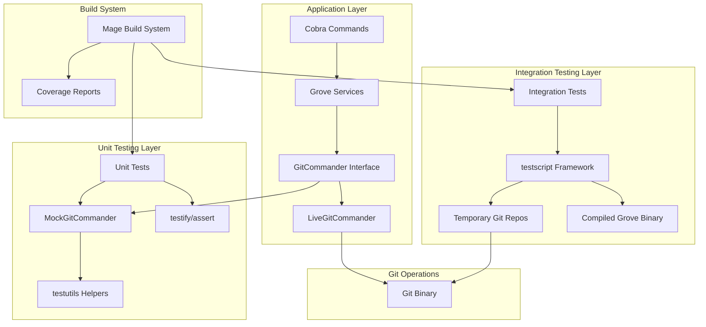

# Design Document

## Overview

The Robust Testing Infrastructure implements a hybrid testing strategy that provides complete isolation and parallel execution capabilities for the Grove CLI application. The design establishes two complementary testing layers: fast unit tests using GitCommander interface abstraction with dependency injection, and high-fidelity integration tests using the testscript framework for end-to-end CLI validation.

This architecture enables reliable testing of Git-heavy operations while maintaining the speed and developer experience required for productive development workflows. The infrastructure leverages existing Grove patterns and integrates seamlessly with the current Mage build system and project structure.

## Steering Document Alignment

### Technical Standards (tech.md)

The design adheres to established technical standards:

- **Go Best Practices**: Uses standard Go project layout with interfaces for dependency injection
- **Testing Framework**: Extends existing testify usage with testify/mock for sophisticated mocking
- **Build System Integration**: Enhances existing Mage targets (test:unit, test:integration) with new capabilities
- **Performance Requirements**: Maintains "snappy and quick" operations with parallel test execution
- **Code Quality**: Supports 90%+ test coverage requirement through comprehensive test infrastructure
- **Architecture Patterns**: Follows existing package separation and configuration-driven design

### Project Structure (structure.md)

Implementation follows documented project organization:

- **Package Placement**: Testing utilities in `/internal/testutils/` as specified
- **Test Organization**: Uses documented patterns (`*_test.go`, `*_integration_test.go`) with build tags
- **File Naming**: Follows snake_case conventions for multi-word file names
- **Command Structure**: Integrates with existing `/internal/commands/` organization
- **Configuration**: Respects existing hierarchy (flags → env vars → config files → defaults)

## Code Reuse Analysis

### Existing Components to Leverage

- **git.DefaultExecutor**: Current Git execution interface will be abstracted behind new GitCommander
- **testify framework**: Existing assertion library extended with testify/mock for sophisticated mocking
- **Mage build system**: Current test targets enhanced with new unit/integration separation
- **internal/errors**: Existing error handling patterns used for test error scenarios
- **internal/logger**: Current logging infrastructure used for test debugging and observability
- **Cobra command structure**: Existing command patterns adapted for dependency injection

### Integration Points

- **Command Factory Pattern**: Existing Cobra commands refactored to accept dependencies via factory functions
- **Configuration System**: Existing Viper-based config adapted to support test environment isolation
- **Error Handling**: Current GroveError patterns extended to cover test-specific error scenarios
- **Retry Mechanisms**: Existing retry infrastructure reused for test reliability
- **Service Layer**: Current service implementations (CreateService, BranchResolver, etc.) adapted for GitCommander injection

## Architecture

The testing infrastructure uses a layered architecture with clear separation between unit and integration testing:



## Components and Interfaces

### GitCommander Interface

- **Purpose:** Abstracts Git command execution for dependency injection and testing
- **Interfaces:**
    ```go
    type Commander interface {
        Run(workDir string, args ...string) (stdout []byte, stderr []byte, err error)
        RunQuiet(workDir string, args ...string) error
    }
    ```
- **Dependencies:** Standard library os/exec for LiveGitCommander implementation
- **Reuses:** Existing git.DefaultExecutor patterns and error handling from internal/errors

### LiveGitCommander

- **Purpose:** Production implementation that executes real Git commands
- **Interfaces:** Implements GitCommander interface
- **Dependencies:** os/exec, internal/logger for operation logging
- **Reuses:** Current Git execution patterns from internal/git/operations.go

### MockGitCommander

- **Purpose:** Test implementation using testify/mock for controlled Git responses
- **Interfaces:** Implements GitCommander interface with expectation setting
- **Dependencies:** testify/mock for sophisticated mock behavior
- **Reuses:** Existing test patterns from testify framework

### testutils Package

- **Purpose:** Centralized testing utilities for Git repository setup and assertions
- **Interfaces:**
    ```go
    func NewTestRepo(t *testing.T) (repoPath string)
    func NewTestRepoWithCommit(t *testing.T) (repoPath, commitHash string)
    func AssertGitState(t *testing.T, repoPath string, expected GitState)
    func CreateMockGitCommander() *MockGitCommander
    ```
- **Dependencies:** testing.T, testify/assert, path/filepath
- **Reuses:** Existing internal/testutils patterns and conventions

### testscript Test Runner

- **Purpose:** Integration test framework for end-to-end CLI testing
- **Interfaces:** TestMain function with Grove binary registration
- **Dependencies:** github.com/rogpeppe/go-internal/testscript
- **Reuses:** Existing Cobra command structure and build system integration

### Command Factory Functions

- **Purpose:** Enable dependency injection into Cobra commands
- **Interfaces:**
    ```go
    type App struct {
        Git git.Commander
        Config *config.Config
        Logger *logger.Logger
    }
    func NewCreateCmd(app *App) *cobra.Command
    ```
- **Dependencies:** Existing command implementations and service layer
- **Reuses:** Current Cobra command patterns and service abstractions

## Data Models

### GitCommander Response

```go
type CommandResult struct {
    Stdout   []byte    // Command standard output
    Stderr   []byte    // Command standard error
    Error    error     // Execution error if any
    ExitCode int       // Process exit code
    Duration time.Duration // Execution time for performance monitoring
}
```

### Test Configuration

```go
type TestConfig struct {
    TempDir          string            // Isolated test directory
    GitConfig        map[string]string // Git configuration overrides
    EnvironmentVars  map[string]string // Environment variable isolation
    CleanupFunctions []func()          // Cleanup functions for test teardown
}
```

### Mock Expectation

```go
type GitExpectation struct {
    WorkDir  string   // Expected working directory
    Args     []string // Expected Git arguments
    Response CommandResult // Mocked response to return
    CallCount int     // Number of times this expectation should be matched
}
```

## Error Handling

### Error Scenarios

1. **Git Command Execution Failure**
    - **Handling:** LiveGitCommander wraps os/exec errors with context information
    - **User Impact:** Clear error messages with Git command details and suggested fixes

2. **Mock Expectation Mismatch**
    - **Handling:** testify/mock provides detailed expectation failure messages
    - **User Impact:** Developer sees exactly which Git command expectation was not met

3. **Test Environment Setup Failure**
    - **Handling:** testutils helpers fail fast with descriptive errors during repository creation
    - **User Impact:** Clear indication of test infrastructure problems vs application bugs

4. **testscript Test Execution Failure**
    - **Handling:** Preserve temporary directories with -work flag for debugging
    - **User Impact:** Access to test artifacts for debugging CLI behavior

5. **Parallel Test Conflicts**
    - **Handling:** Each test uses unique temporary directories and isolated configuration
    - **User Impact:** Reliable test execution without flaky failures from test interference

6. **Cross-Platform Compatibility Issues**
    - **Handling:** Use path/filepath for platform-appropriate path handling
    - **User Impact:** Consistent test behavior across Windows, macOS, and Linux

## Testing Strategy

### Unit Testing

**Approach:** Fast, isolated tests using GitCommander mocks to test business logic without Git dependencies

**Key Components to Test:**

- Command argument parsing and validation
- Git command construction and parameter handling
- Error handling and user message formatting
- Configuration loading and environment variable processing
- Service layer business logic (CreateService, BranchResolver, etc.)

**Test Structure:**

- Use testify/assert for assertions and testify/mock for GitCommander expectations
- Follow Arrange-Act-Assert pattern with clear section comments
- One test file per source file following `*_test.go` convention
- Comprehensive error path testing with mocked Git failures

### Integration Testing

**Approach:** End-to-end testing using testscript framework with real Git operations and compiled Grove binary

**Key Flows to Test:**

- Complete CLI workflows (grove create, grove list, grove cleanup)
- Error scenarios with real Git repository states
- Configuration file loading and environment variable handling
- Cross-platform command execution and output formatting
- Git repository state validation after operations

**Test Structure:**

- Use testscript with txtar format for declarative test scenarios
- Each test script creates isolated Git repositories in temporary directories
- Tests validate both command output and resulting Git repository state
- Build tags separate integration tests from unit tests

### End-to-End Testing

**Approach:** Comprehensive user scenarios using testscript with complex Git repository setups

**User Scenarios to Test:**

- Multi-worktree workflows with parallel development
- Error recovery and cleanup operations
- Integration with development tools and configuration management
- Large repository performance and scalability
- Platform-specific behavior and file system interactions

**Implementation:**

- Complex test fixtures using template repositories
- Performance validation with timing assertions
- User experience validation through output formatting tests
- Configuration hierarchy testing with multiple config sources
